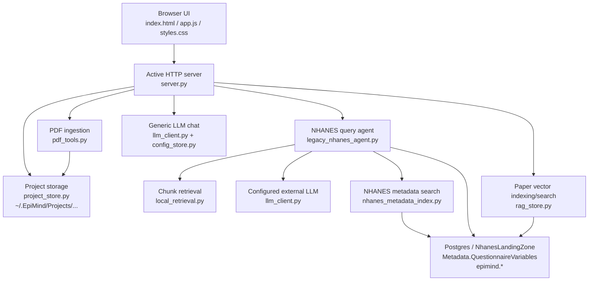

# Architecture Overview

This document describes the current architectural shape of `EpiconUI` as it exists today, not the eventual target architecture.

## Executive Summary

`EpiconUI` currently has two overlapping back-end structures:

1. An active browser-facing runtime built around a small local server.
2. A larger `nhanes_agent/` scaffold that represents the intended modular FastAPI future state.

The active runtime is the system that matters for current behavior. It serves the UI, stores project files under `~/.EpiMind`, ingests PDFs, indexes papers into Postgres/pgvector, and answers NHANES-oriented questions by combining:

- paper chunk retrieval
- LLM interpretation
- Postgres metadata validation
- deterministic rendering

The `nhanes_agent/` package is useful as a design target, but it is not the main runtime path for the browser UI yet.

## Current Layers

## Architectural Truths

### 1. The active UI uses `server.py`

The browser currently talks to [server.py](/Users/robert/Projects/Epiconnector/EpiconUI/server.py), not to `uvicorn nhanes_agent.main:app`.

That means:

- route behavior is defined by `server.py`
- the UI contract is defined by `server.py` responses
- any change that matters to the current browser experience must be reflected there

### 2. `legacy_nhanes_agent.py` is the live NHANES query engine

Despite the name, [legacy_nhanes_agent.py](/Users/robert/Projects/Epiconnector/EpiconUI/legacy_nhanes_agent.py) is currently the active implementation behind `/api/agent/query`.

It now has a narrower role than before:

- classify intent with the configured LLM
- retrieve paper evidence chunks
- ask the LLM to interpret evidence
- search and validate NHANES metadata
- produce a concise answer and a saved report

It should be treated as the live integration layer until the FastAPI package fully replaces it.

### 3. `nhanes_agent/` is a scaffold, not the browser runtime

The `nhanes_agent/` package contains a more modular service layout:

- api
- services
- models
- prompts
- tests

This is useful for future migration, but it is not yet the primary request path for the current UI.

### 4. There are two data planes

`EpiconUI` persists state in two different places:

- local filesystem under `~/.EpiMind`
- Postgres in `NhanesLandingZone`

Those are complementary, not redundant.

Filesystem holds:

- project/paper directories
- extracted paper assets
- generated outputs
- lightweight metadata JSON

Postgres holds:

- vector-indexed paper chunks in `epimind.*`
- NHANES metadata truth in `Metadata.QuestionnaireVariables`
- NHANES metadata vector index in `epimind.nhanes_variable_metadata`

## Current Responsibility Split

| Concern | Primary Module |
|---|---|
| Browser UX | [app.js](/Users/robert/Projects/Epiconnector/EpiconUI/app.js) |
| HTTP API | [server.py](/Users/robert/Projects/Epiconnector/EpiconUI/server.py) |
| Project filesystem | [project_store.py](/Users/robert/Projects/Epiconnector/EpiconUI/project_store.py) |
| PDF extraction/chunking | [pdf_tools.py](/Users/robert/Projects/Epiconnector/EpiconUI/pdf_tools.py) |
| Paper vector indexing | [rag_store.py](/Users/robert/Projects/Epiconnector/EpiconUI/rag_store.py) |
| Generic chat LLM calls | [llm_client.py](/Users/robert/Projects/Epiconnector/EpiconUI/llm_client.py) |
| Embedding calls | [embedding_client.py](/Users/robert/Projects/Epiconnector/EpiconUI/embedding_client.py) |
| NHANES agent queries | [legacy_nhanes_agent.py](/Users/robert/Projects/Epiconnector/EpiconUI/legacy_nhanes_agent.py) |
| NHANES metadata candidate search | [nhanes_metadata_index.py](/Users/robert/Projects/Epiconnector/EpiconUI/nhanes_metadata_index.py) |

## Active Design Principle

The active query design should now be understood as:

- LLM for interpretation
- database for truth
- local files for state and outputs

That is the key conceptual boundary a new developer should preserve.

## Where To Refactor Next

If this codebase is refactored again, the most useful migration path is:

1. keep the UI contract stable
2. move logic out of `legacy_nhanes_agent.py`
3. move the active runtime into the `nhanes_agent/` service layout
4. keep `server.py` thin or replace it with the FastAPI app entirely

Do not start by rewriting the frontend or storage layout. The real complexity is in the query pipeline boundaries.
