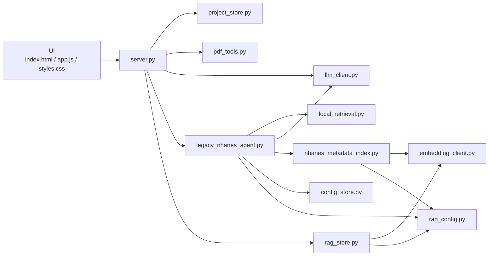

# Module Map

This document is a practical guide to where things live and which modules are active, transitional, or scaffold-only.

## Top-Level Module Roles

| Module | Status | Purpose |
|---|---|---|
| [server.py](/Users/robert/Projects/Epiconnector/EpiconUI/server.py) | Active | Browser-serving HTTP API |
| [app.js](/Users/robert/Projects/Epiconnector/EpiconUI/app.js) | Active | Browser interactions and API calls |
| [project_store.py](/Users/robert/Projects/Epiconnector/EpiconUI/project_store.py) | Active | `~/.EpiMind` projects/papers metadata and ingest coordination |
| [pdf_tools.py](/Users/robert/Projects/Epiconnector/EpiconUI/pdf_tools.py) | Active | PDF extraction, markdown generation, chunks, assets |
| [rag_store.py](/Users/robert/Projects/Epiconnector/EpiconUI/rag_store.py) | Active | Postgres schema creation and paper chunk vector indexing |
| [legacy_nhanes_agent.py](/Users/robert/Projects/Epiconnector/EpiconUI/legacy_nhanes_agent.py) | Active | Live NHANES query orchestration |
| [nhanes_metadata_index.py](/Users/robert/Projects/Epiconnector/EpiconUI/nhanes_metadata_index.py) | Active | NHANES metadata candidate retrieval layer |
| [llm_client.py](/Users/robert/Projects/Epiconnector/EpiconUI/llm_client.py) | Active | Chat-completion transport |
| [embedding_client.py](/Users/robert/Projects/Epiconnector/EpiconUI/embedding_client.py) | Active | Embedding transport |
| [local_retrieval.py](/Users/robert/Projects/Epiconnector/EpiconUI/local_retrieval.py) | Active | Simple lexical chunk retrieval |
| [config_store.py](/Users/robert/Projects/Epiconnector/EpiconUI/config_store.py) | Active | Stored LLM configuration |
| [rag_config.py](/Users/robert/Projects/Epiconnector/EpiconUI/rag_config.py) | Active | DB and embedding runtime config |
| [nhanes_agent/](/Users/robert/Projects/Epiconnector/EpiconUI/nhanes_agent) | Scaffold | Future modular FastAPI package |

## Active Runtime Dependency Map

## Current Modularity Boundaries

### UI boundary

The frontend should only know:

- current project and selected paper
- which API route to call
- whether the query is `Quick View` or `Save As Output`

It should not know:

- how NHANES metadata is validated
- how vector retrieval works
- how output files are written

### Server boundary

[server.py](/Users/robert/Projects/Epiconnector/EpiconUI/server.py) should remain a route layer that:

- parses requests
- invokes service modules
- returns JSON

If new business logic is added there, that is architectural debt.

### Agent boundary

[legacy_nhanes_agent.py](/Users/robert/Projects/Epiconnector/EpiconUI/legacy_nhanes_agent.py) is responsible for:

- coordinating query execution
- prompting the LLM
- combining retrieval with validation
- building query-specific outputs

It should not become:

- the place where all DB schemas are defined
- the place where PDF ingestion happens
- the place where UI state is assembled

### Metadata search boundary

[nhanes_metadata_index.py](/Users/robert/Projects/Epiconnector/EpiconUI/nhanes_metadata_index.py) should be limited to:

- building the NHANES metadata vector table
- searching candidate metadata rows
- returning candidate objects

It should not:

- decide the final answer text
- own prompt construction for the whole query system
- replace relational validation

### RAG boundary

[rag_store.py](/Users/robert/Projects/Epiconnector/EpiconUI/rag_store.py) is about uploaded-paper chunks, not NHANES metadata.

That separation matters:

- `rag_store.py` indexes paper content
- `nhanes_metadata_index.py` indexes metadata rows

Those are distinct retrieval problems.

## Active vs Planned Structure

### Active now

- `server.py`
- top-level service modules
- browser UI

### Planned direction

- move active service logic into `nhanes_agent/app/services/...`
- move active routes into `nhanes_agent/app/api/...`
- keep the same conceptual boundaries, but with better physical separation

## Where New Code Should Go

Use this rule set for new work:

- new browser behavior: `app.js`, `index.html`, `styles.css`
- project/paper storage logic: `project_store.py`
- PDF parsing or asset extraction: `pdf_tools.py`
- paper vector indexing/search: `rag_store.py`
- NHANES metadata retrieval/indexing: `nhanes_metadata_index.py`
- NHANES query orchestration: `legacy_nhanes_agent.py`
- generic LLM transport/config: `llm_client.py`, `config_store.py`

If a new feature does not fit one of those buckets, it is a sign the code should probably move toward the `nhanes_agent/` package layout instead of growing top-level modules further.
