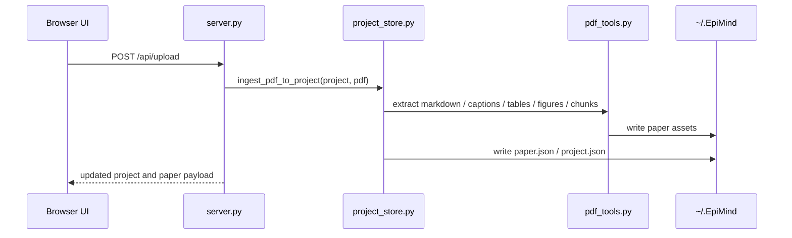
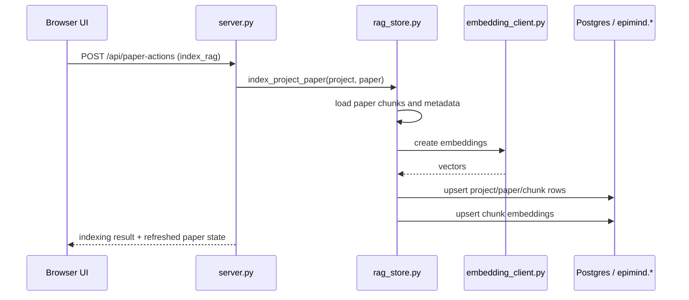
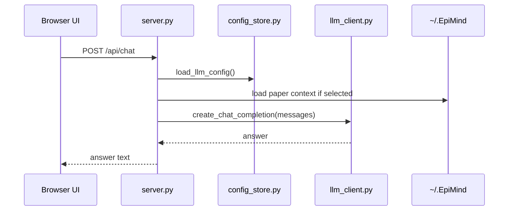
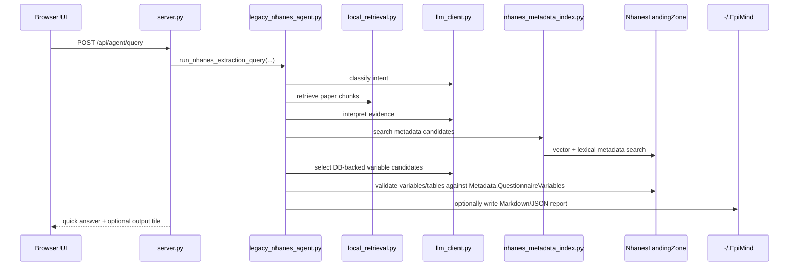
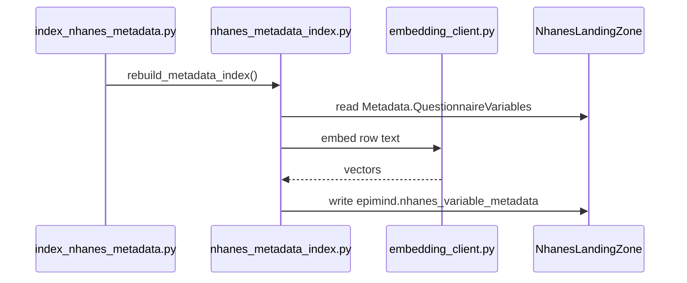

# Runtime Flows

This document shows the main execution paths that are active today.

## 1. Paper Ingestion Flow

Active files:

- [server.py](/Users/robert/Projects/Epiconnector/EpiconUI/server.py)
- [project_store.py](/Users/robert/Projects/Epiconnector/EpiconUI/project_store.py)
- [pdf_tools.py](/Users/robert/Projects/Epiconnector/EpiconUI/pdf_tools.py)

## 2. Paper Vector Indexing Flow

Active files:

- [server.py](/Users/robert/Projects/Epiconnector/EpiconUI/server.py)
- [rag_store.py](/Users/robert/Projects/Epiconnector/EpiconUI/rag_store.py)
- [embedding_client.py](/Users/robert/Projects/Epiconnector/EpiconUI/embedding_client.py)

## 3. Generic Chat Flow

This is the non-agent chat path used for simple LLM interaction.

Active files:

- [server.py](/Users/robert/Projects/Epiconnector/EpiconUI/server.py)
- [config_store.py](/Users/robert/Projects/Epiconnector/EpiconUI/config_store.py)
- [llm_client.py](/Users/robert/Projects/Epiconnector/EpiconUI/llm_client.py)

## 4. NHANES Query Agent Flow

This is the most important flow for current development.

Active files:

- [server.py](/Users/robert/Projects/Epiconnector/EpiconUI/server.py)
- [legacy_nhanes_agent.py](/Users/robert/Projects/Epiconnector/EpiconUI/legacy_nhanes_agent.py)
- [local_retrieval.py](/Users/robert/Projects/Epiconnector/EpiconUI/local_retrieval.py)
- [nhanes_metadata_index.py](/Users/robert/Projects/Epiconnector/EpiconUI/nhanes_metadata_index.py)

## 5. NHANES Metadata Index Build Flow

Active files:

- [index_nhanes_metadata.py](/Users/robert/Projects/Epiconnector/EpiconUI/index_nhanes_metadata.py)
- [nhanes_metadata_index.py](/Users/robert/Projects/Epiconnector/EpiconUI/nhanes_metadata_index.py)

## Boundary Rules

These are the runtime boundaries a developer should preserve:

- `server.py` should stay a transport layer, not a business-logic sink.
- `legacy_nhanes_agent.py` should orchestrate, not own storage or retrieval primitives.
- `nhanes_metadata_index.py` should search NHANES metadata, not render answers.
- `rag_store.py` should manage paper vector indexing, not NHANES semantics.
- `project_store.py` should manage the filesystem contract, not agent reasoning.
